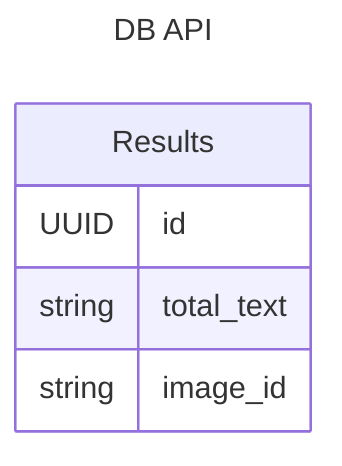
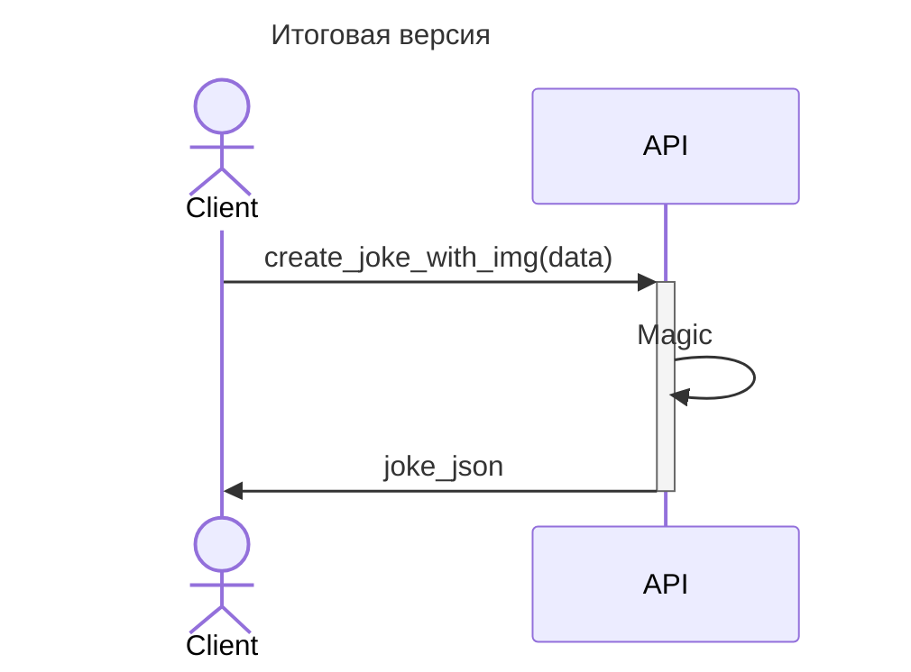
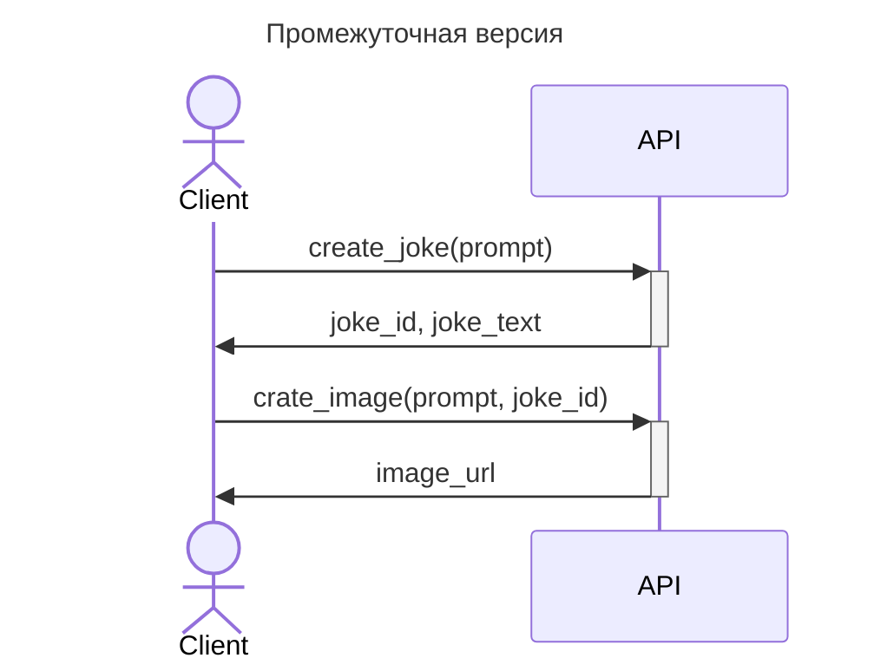
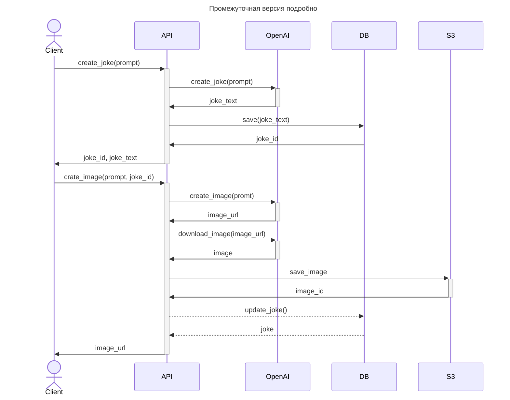

```mermaid
---
title: DB API
---
erDiagram
    Results {
        UUID id
        string total_text
        string image_id
    }
```

```mermaid
---
title: Итоговая версия
---
sequenceDiagram
  actor Client
  participant API

  
  Client->>+API: create_joke_with_img(data)
  API->>API: Magic
  API->>-Client: joke_json
  
```

```mermaid
---
title: Промежуточная версия 
---
sequenceDiagram
  actor Client
  participant API


  
  Client->>+API: create_joke(prompt)
  API->>-Client: joke_id, joke_text
  Client->>+API: crate_image(prompt, joke_id)
  API->>-Client: image_url
  
```

```mermaid
---
title: Промежуточная версия подробно
---
sequenceDiagram
  actor Client
  participant API
  participant OpenAI
  participant DB
  participant S3

  
  Client->>+API: create_joke(prompt)
  API->>+OpenAI: create_joke(prompt)
  OpenAI->>-API: joke_text
  API->>DB: save(joke_text)
  DB->>API: joke_id
  API->>-Client: joke_id, joke_text
  Client->>+API: crate_image(prompt, joke_id)
  API->>+OpenAI: create_image(promt)
  OpenAI->>-API: image_url
  API->>+OpenAI: download_image(image_url)
  OpenAI->>-API: image
  API->>+S3: save_image
  S3->>-API: image_id
  API-->>DB: update_joke()
  DB-->>API: joke
  API->>-Client: image_url
  
```
